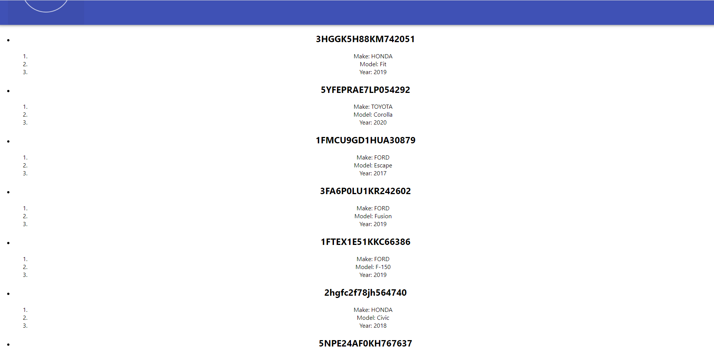

# CooperCars: US-11
## Current Functionality:
#### 'Add Vehicles' page: User enters a VIN, dealer/sale price. Vehicle details are added to CSV database and info presented.

#### 'Browse Vehicles' page: Reads all the vehicles in the CSV database.

## Backend:
#### http://localhost:8080/api/vehicle/{vin}/{dealerPrice}/{salePrice} returns info about ONE vehicle, passes to back end price info from front end.
#### http://localhost:8080/api/vehicles returns info about ALL vehicles in database
## Next steps:
#### Social login. Seperate platforms for dealer/consumer.
#### Add sorting/filtering by vehicle specification. Reference: https://www.freecodecamp.org/news/search-and-filter-component-in-reactjs/
#### CSV database to SQL :-)
#### DONE: When adding a vehicle, prompt for sale price and dealer price

