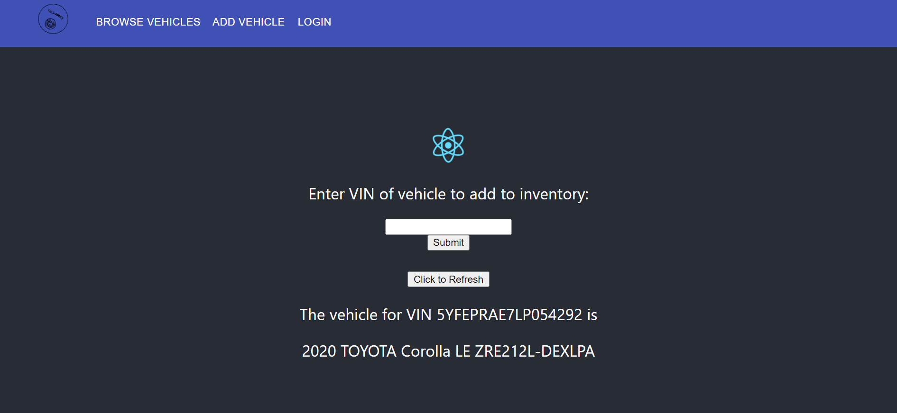

# CooperCars: US-7 
### Connects a custom-made VehicleAPI to the front-end. This is based on the Borsa project and needs to be renamed and refactored. 
#### Merged with dguo-us-12 to add title navigation bar and re-implement text box.
#### WIP!!! Currently, the text box does absolutely nothing (and also doesn't work properly). The vehicle displayed is based on a set of pre-defined VINs.
#### Todo: present the vehicle based on what's passed in the text box.
#### Todo: re-factor and rename everything from borsa to coopercars.

