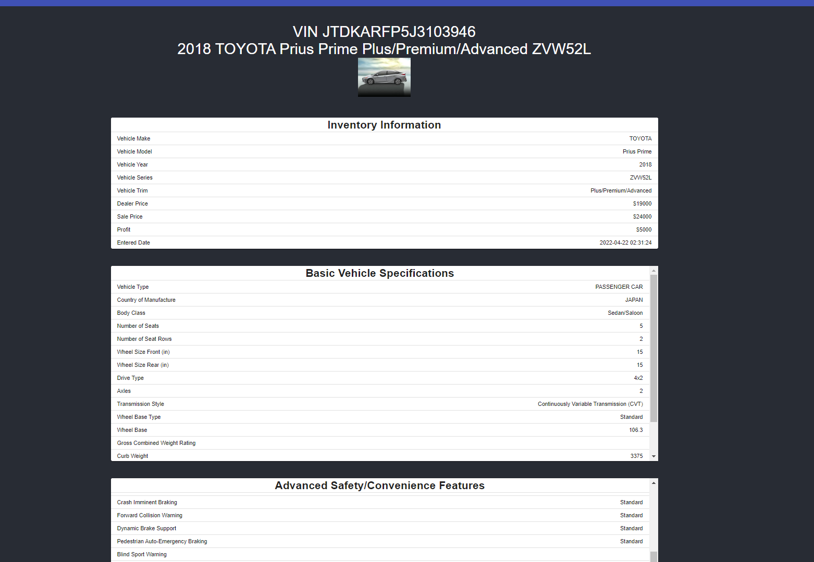

# CooperCars: merged-US-14 - merged features US-13 (add vehicle with spreadsheet) and US-14 (vehicle details page)
## Functionality:
#### In the Browse Vehicles page, each vehicle's image and VIN number is linked to a dynamically routed page. 
#### By clicking on the vehicle's image/VIN, React will link to that vehicle's specific landing page where we plan to show an in-depth view of the vehicle
#### Ie: http://localhost:3000/browse/{VIN} will show vehicle details pertaining to that specific VIN.

## API endpts:
#### http://localhost:8080/api/vehicle/getinfo/{vin} returns info about ONE vehicle
#### http://localhost:8080/api/vehicle/addvehicle adds from front end input
#### http://localhost:8080/api/vehicle/remove/{vin} deletes vehicle by VIN
#### http://localhost:8080/api/vehicles returns info about ALL vehicles in database
## Notes:
#### I updated react to work with mui's tables, but this broke the login page. Will need to check on this when we merge this feature with login. 
## Next steps:
#### IMP: Secure endpoints (after login is working ofc)!!!!!!!!
#### WIP: Add sorting/filtering by vehicle specification. Reference: https://www.freecodecamp.org/news/search-and-filter-component-in-reactjs/
#### WIP: allow user to upload a spreadsheet to add vehicles.

