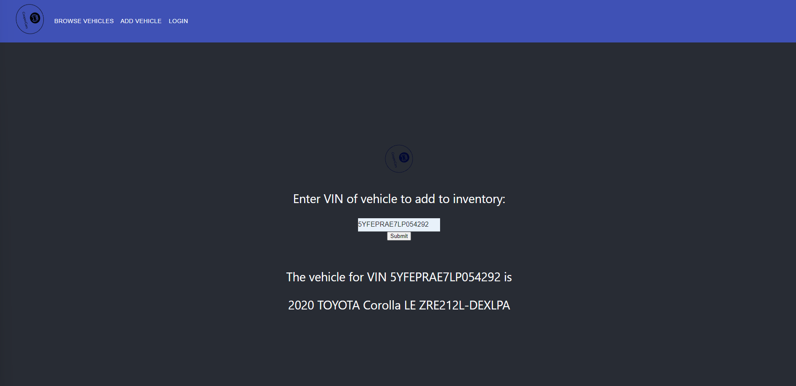

# CooperCars: US-8
### Connects a custom-made VehicleAPI to the front-end. 
#### Done: present the vehicle and some features based on what's passed in the text box.
#### Merged with dguo-us-12 to add title navigation bar, re-implement text box.
#### Merged with jcho-us-8 to add routing. 
### Note: run 'npm install -S react-router-dom'

