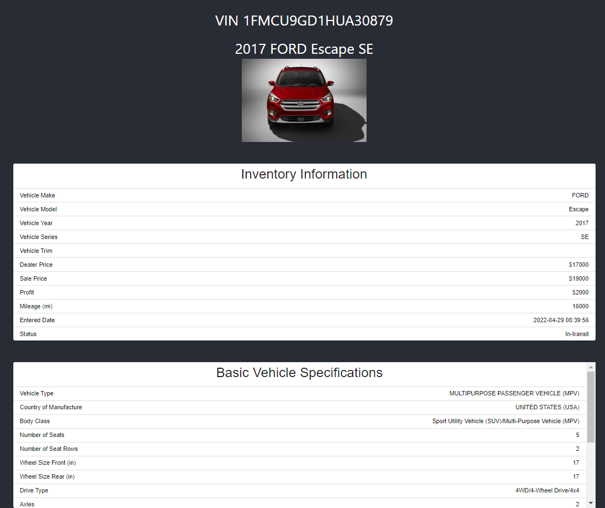
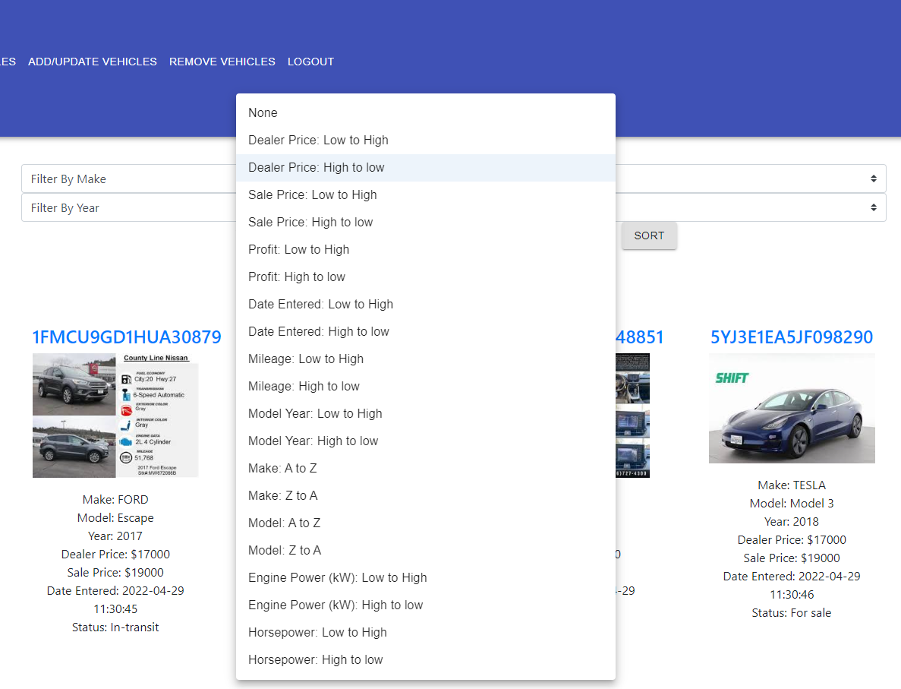

# CooperCars: US-16 (add status & mileage tag to vehicle, remove by status, sort by params)
This US marks each vehicle as In-transit, for sale, or sold and adds mileage to inventory details.
Also adds functionality to sort by asc/desc parameters (see below).
Adds onto SDE-merged-US-15, refer that for functionality.
## Sorting APIs:
#### http://localhost:8080//vehicles/sort/sale/{asc/desc}
#### http://localhost:8080//vehicles/sort/dealer/{asc/desc}
#### http://localhost:8080//vehicles/sort/profit/{asc/desc}
#### http://localhost:8080//vehicles/sort/date/{asc/desc}
#### http://localhost:8080//vehicles/sort/year/{asc/desc}
#### http://localhost:8080//vehicles/sort/enginepower/{asc/desc}
#### http://localhost:8080//vehicles/sort/horsepower/{asc/desc}
#### http://localhost:8080//vehicles/sort/displacementCC/{asc/desc}
#### http://localhost:8080//vehicles/sort/make/{asc/desc}
#### http://localhost:8080//vehicles/sort/model/{asc/desc}
## Functionality:
#### Status and mileage shows up on vehicle details page. Add vehicle by spreadsheet working.
#### Sort by params working. 
#### Remove by status is now working. 
#### WIP: clean up outputs and UI
#### TODO: add an output when clicked submit button

## API endpts:
#### http://localhost:8080/api/vehicle/getinfo/{vin} returns info about ONE vehicle
#### http://localhost:8080/api/vehicle/addvehicle adds from front end input
#### http://localhost:8080/api/vehicle/remove/{vin} deletes vehicle by VIN
#### http://localhost:8080/api/vehicle/remove/status/{stat} deletes vehicle by status
#### http://localhost:8080/api/vehicles returns info about ALL vehicles in database
## Next steps:
#### IMP: Secure endpoints (after login is working ofc)!!!!!!!!
#### WIP: Add sorting/filtering by vehicle specification. Reference: https://www.freecodecamp.org/news/search-and-filter-component-in-reactjs/

