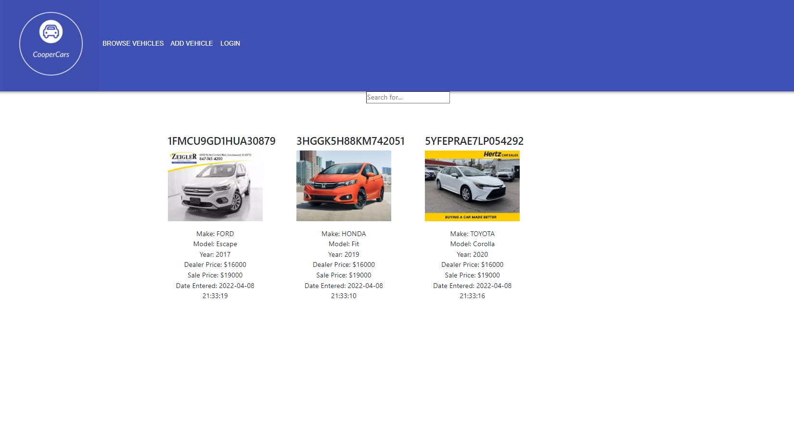

# CooperCars: US-10 - transitioned CSV database to mySQL database
## Note: mySql command: create database coopercars; (do this before running)
## Current Functionality:
#### 'Browse Vehicles' page: Reads all the vehicles in the database. Filter by Make currently working.

## Backend:
#### http://localhost:8080/api/vehicle/{vin}/{dealerPrice}/{salePrice} returns info about ONE vehicle, passes to back end price info from front end.
#### http://localhost:8080/api/vehicles returns info about ALL vehicles in database
## Next steps:
#### DONE: Save date/time when vehicle was added.
#### DONE: Since vehicles are now store in mySQL database with VINs as the 'key', it won't add the same vehicle twice to database.
#### Note: Attempted to pull down first image from Google Search... ok reliability, but image is "encrypted (ie: supppper compressed)"
#### WIP: Social login. Seperate platforms for dealer/consumer.
#### WIP: Add sorting/filtering by vehicle specification. Reference: https://www.freecodecamp.org/news/search-and-filter-component-in-reactjs/
#### NEXT SPRINT: delete vehicle from database
#### NEXT SPRINT: allow user to upload a spreadsheet to add vehicles.

