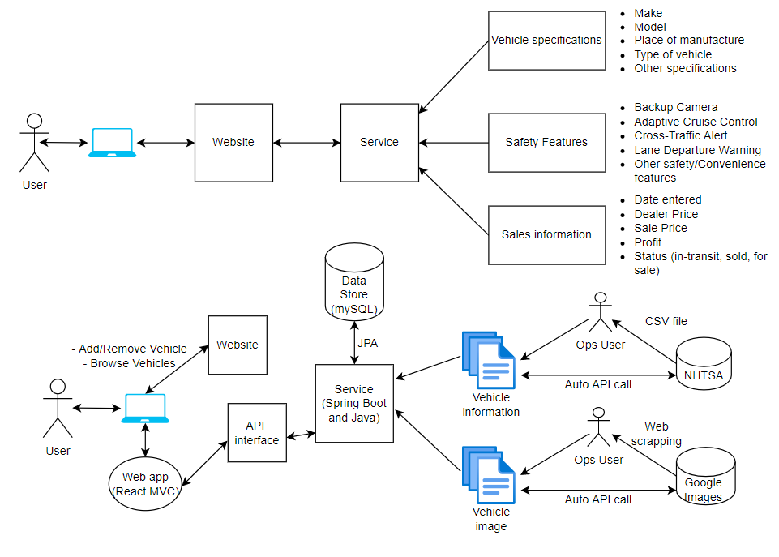

# CooperCars: Vehicle Inventory Management Solution for Small Independent Car Dealers
### ECE366: Software Engineering & Large Systems Design 
### Professor R. Marano
### David Guo, Steven Joongyeon Cho, Eric Xu

## Introduction
- Our solution provides the dealer with **valuable information** about vehicles available in inventory and is designed as a **tool for the dealer to use** when **consulting with a potential customer**.
- Solution is designed for a **dealer to reference** when consulting with a client. The dealer employee can look up vehicles on his/her computer and **show the client results** from the application.
- The dealer will add vehicles to inventory by **uploading a spreadsheet** with VINs and pertaining information. **VIN (vehicle identification number)** are unique to each vehicle, and **every vehicle is assigned one** in the U.S.
- **Data and image** of vehicle is pulled from **online sources** and presented in its own landing page.
- With our solution, dealers **no longer** have to **rummage through old window stickers** or **documentation** to see what **features or specifications** go with which car - **our solution does that for you**!

## Features
- Dealer **logins** to access the application. This ensures an unauthorized third party cannot access inventory information. 
- **Easy-to-use** interface to view inventory. 
- Quickly **filter and sort** vehicles based on feature interest (**safety features, vehicle type, fuel source**). 
- View **detailed specs**, **sales information**, and **pictures** of each vehicle. 
- Easily **upload a spreadsheet** to batch add to inventory (designed to work well with dealer’s **existing workflows**). 
- Remove from inventory based on **sales status** or via **spreadsheet**.

## Purpose and Business Outcomes 
- Dealers may carry **hundreds of vehicles** of different makes and models. 
- Our inventory management solution targets small car dealers that only uses an **Excel spreadsheet or basic database software** (Microsoft Access) to manage their inventory.
- Solution streamlines a car dealer’s workflow, allowing them to focus on things **other than mundane inventory management**.
- [**According to Consumer Reports:**](https://www.consumerreports.org/car-safety/car-safety-survey-new-car-buyers-want-advanced-safety-not-automation/) “In a national survey of U.S. drivers planning on buying a new or used vehicle in the next two years, 51 percent said it was important that their next car have a rearview camera or backup warning, and 45 percent said they wanted a blind-spot warning system.”
- Our solution allows the dealer to **quickly understand** which vehicles in their inventory have these safety features and meet this crucial **consumer need**.

## How to run from scratch (on IntelliJ)
1) Clone our repo from Github. 
2) Go to `./coopercars-service/src/main/java/RestApiServer`.
3) Ensure JDK 17.0 is installed, then build RestApiServer.
4) Check configuration settings to run RestAPIServer:
   
   NOTE: This application uses port 3000 and 8080. Ensure these ports are not already in use.
5) Ensure [npm](https://docs.npmjs.com/downloading-and-installing-node-js-and-npm) is installed on your machine.
6) Go to terminal in IntelliJ, change directory into `./coopercars-app`, and run the following: `npm i react-select`, `npm i xlsx`, `npm install @mui/system @emotion/react @emotion/styled`. 
   NOTE: If an issue occurs, try deleting ./coopercars-app/node_modules and running with the `--force` tag.
7) Then, run: `npm install`. 
   NOTE: If an issue occurs, try deleting ./coopercars-app/node_modules and running `npm install --force` again.
8) Run: `npm start`. 
   NOTE: If you run into an issue with starting, try deleting `"proxy": "http://localhost:5000"` in `./coopercars-app/package.json`.
9) ENJOY! 
   ADDITIONAL NOTE: The backend database is running on an already configured Amazon RDS server, no additional action is needed to set this up. 
   In the case you would like the database to be local, head to `./coopercars-service/src/main/resources/application.yml` and change the datasource to your mySQL server credentials. 

## How-To Guide
- Upon visiting http://localhost:3000/, the only visible tab is the Login tab.
- You must login to access the application. This is to ensure that a car dealer's critical inventory information will not get into the hands of bad actors.
  
- Once you login, you will have full access to the application.
  
- Starting with the `Browse Vehicles` tab, there are three different ways to sort/filter the cars that are presented.
    1) Filter results by typing in the Make or Model of the car (for example: `Corolla` or `Toyota`)
       
    2) Sort by a certain parameter such as Dealer Price, Sale Price, Profit, Mileage, Year, etc.
       
    3) Filter by specifications such as Type, Body, Make, Fuel Type, etc. Click on the dropdown to select a specific option.
       
    4) Filter by multiple safety features such as backup camera, blind spot monitor, etc by clicking on the checkbox within the dropdown menu.
       
- Each vehicle card in the `Browse Vehicles` tab is linked to its own landing page. Click on it to view more details about that specific vehicle.
  
- The `Add/Update Vehicles` tab is quite self-explanatory: you can choose to upload a spreadsheet (column parameters are defined in the next section), or manually enter details of the vehicle to add to inventory.
  
- The `Remove Vehicles` tab is also quite self-explanatory: you can choose to upload a spreadsheet with VINs, enter a VIN to directly remove from inventory, or select a Status (ie: Sold, For Sale, In-transit) to batch remove from inventory.
    

## Format for spreadsheets used to batch add/remove vehicles
**Add:** Columns are VIN, Dealer Price, Sale Price, Mileage, Status (Sold, For sale, In-transit).
 
**Remove:** Only a list of VINs.  
 

## Spreadsheets to test application
**_There are spreadsheets attached to this repo (under the `spreadsheets` directory) to test the application._ **

**Name:** `sampleSpreadsheet.xlsx` 
**Purpose:** Test adding vehicles with a variety of 70 different vehicles. These VINs came from actual cars for sale by dealers across the U.S.! 

**Name:** `sampleSpreadsheet2.xlsx` 
**Purpose:** Test adding vehicles with another set of 70 different vehicles. These VINs came from actual cars for sale by dealers across the U.S.! 

**Name:** `sampleSpreadsheetMaster.xlsx` 
**Purpose:** Test adding vehicles with a master set of 140 vehicles (two 70s merged together). These VINs came from actual cars for sale by dealers across the U.S.! 

**Name:** `sampleSpreadsheetTest.xlsx` 
**Purpose:** Test adding vehicles with a test set of 20 vehicles (used for debugging). 

**Name:** `sampleSpreadsheet1000.xlsx` 
**Purpose:** A stress test for adding vehicles with a 1000 vehicles. VINs were randomly generated using a [Python script](https://replit.com/@exu4630/RandomVINGenerator) (since these VINs were randomly generated, many vehicles are not consumer vehicles and therefore this file is more for stress-testing the backend because the filtering/sorting with these random vehicles isn't too representative of what a dealer would typically have). 

**Name:** `sampleRemoveSpreadsheet.xlsx`  
**Purpose:** Test remove vehicles with a set of 44 VINs that were in `sampleSpreadsheet.xlsx`, `sampleSpreadsheetMaster.xlsx`, and `sampleSpreadsheet1000.xlsx`. 

## Overall Architecture

## UML of Vehicle Backend

## Images of Application

